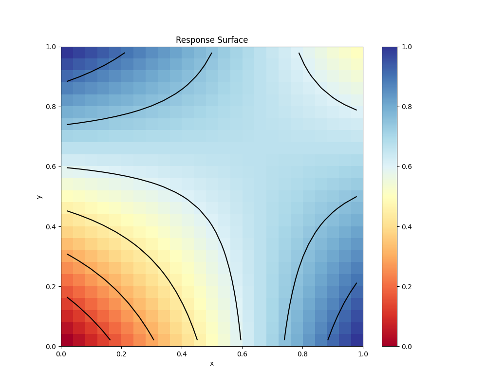
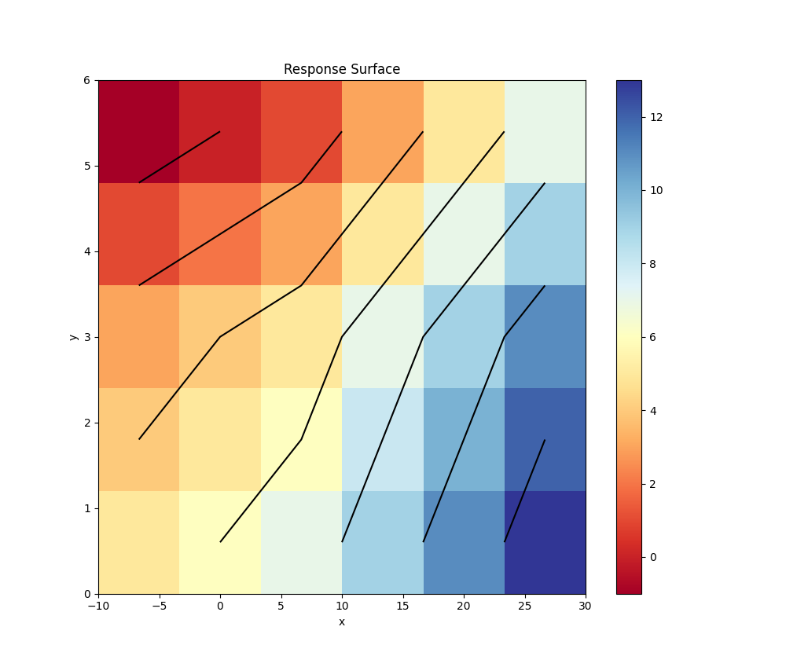
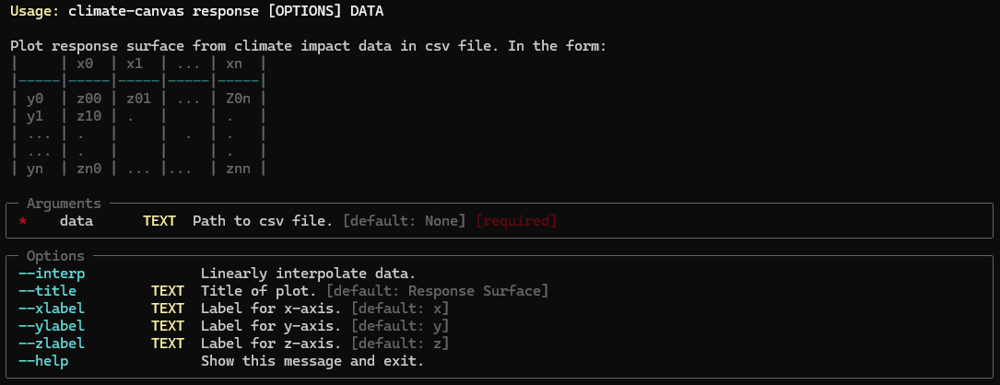
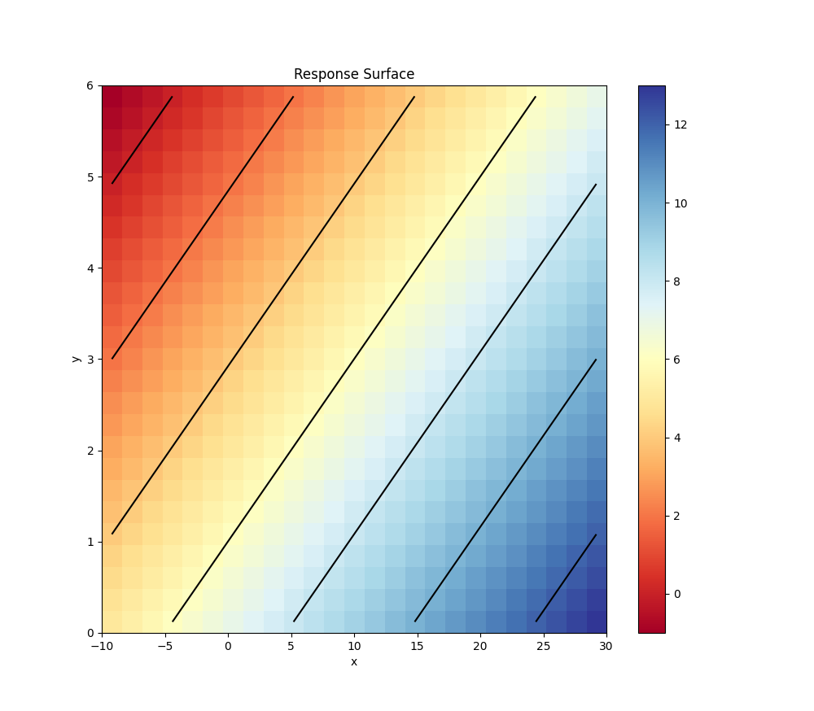

# climate-canvas

Python package and command line interface (CLI) for plotting climate impact study response surfaces and other climate change scenario visualizations.

Example: The figure above is created by running the ``python climate_canvas response examples\complex_surface.csv --interp`` climate-canvas CLI command on the *complex_surface.csv* data distributed with the climate-canvas program.

## Installation Instructions

#### System Requirements

climate-canvas requires python 3.12+. It aims to be multi-platform and has been run on Windows 11 and MacOS 14 and 15.

#### Clone or Fork climate-canvas from GitHub
The climate-canvas source code can be found here: https://github.com/JohnRushKucharski/climate-canvas is available under the GNU Version 3 General Public License.

It can be cloned or forked by following the normal cloning or forking instructions, which are available here: https://docs.github.com/en/repositories/creating-and-managing-repositories/cloning-a-repository and here: https://docs.github.com/en/pull-requests/collaborating-with-pull-requests/working-with-forks/fork-a-repo.

#### Installation with Poetry

climate-canvas is developed with Poetry, which can be used to simply the installation process.

To install Poetry, follow the instructions here: https://python-poetry.org/docs/.

Once Poetry is installed, use your favorite shell to go to the location of the local climate-canvas repository, e.g.

``
cd <PATH_TO_LOCAL>\climate-canvas
``

Next run:

``
poetry install
``

This will create a python virtual environment containing all the required climate-canvas dependencies, without affecting your system's global python environment.

The climate-canvas program should be ready for use as either a python package or command line utility. To test the command line interface (CLI) type the following command into your shell:

``
poetry run python climate_canvas
``

This should return help instructions for the climate-canvas CLI.

## Basic Usage

The climate-canvas program can be extended as a python package or run through a command line interface (CLI).

The current version (0.1.0) only supports 2D climate response surface style plots. These are two-dimensional contour plots that show the impact of two variables plotted on the x and y axes on a response (i.e. z axis) variable whose values are plotted using contour lines and a colorbar. An example is shown below.

#### Command Line Interface

The example above is created **response** command. From a shell run:

``
python climate_canvas response --help
``

To view help for the **response** command, i.e.:

As the response help document describes the **response** command requires that a path to a *.csv* file containing plotting data be specified. Two example, data files are provided in the repository's *examples/* directory. The following command, using on of these example files, reproduces the figure above:

``
python climate_canvas response examples\scenario_data.csv
``

The *--interp* flag can be used to bi-linearly interpolate between z-axis values. For example, running the following command (using the same data from the figure above) with the *--interp* flag produces the figure below:

``
python climate_canvas response examples\scenario_data.csv --interp
``

As the help documentation shows titles for the figure, x, y, and z axes can be added as optional arguments.
