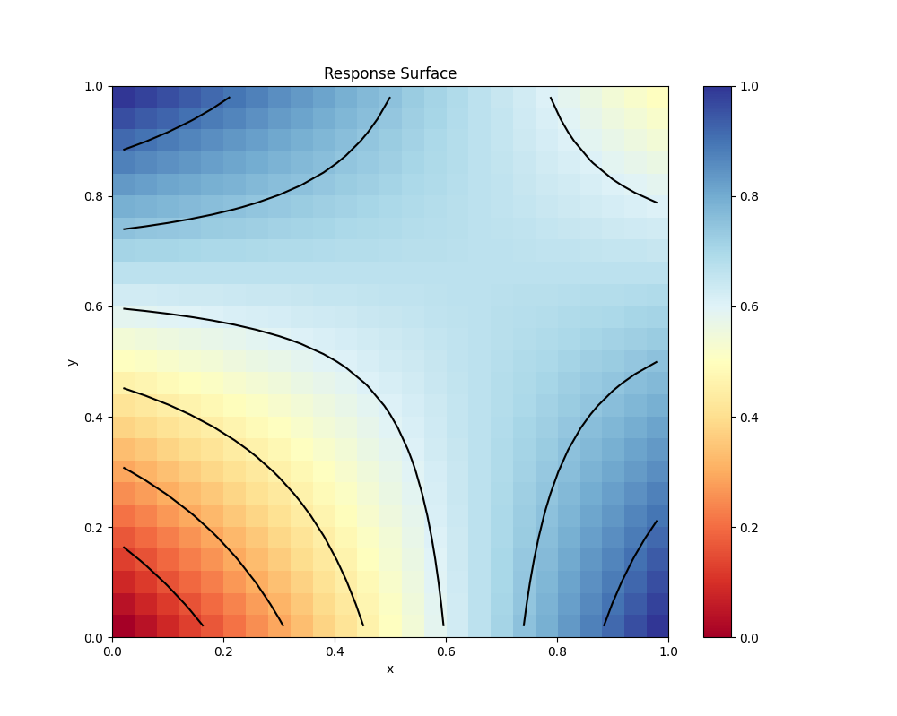
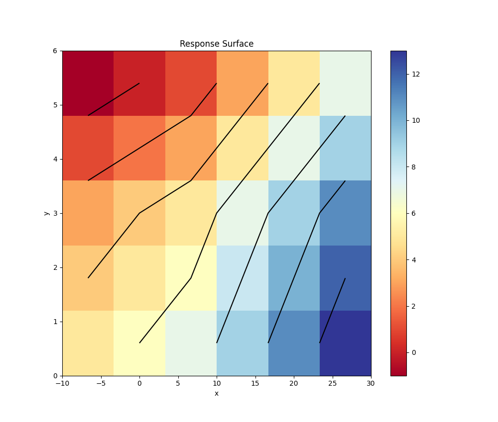
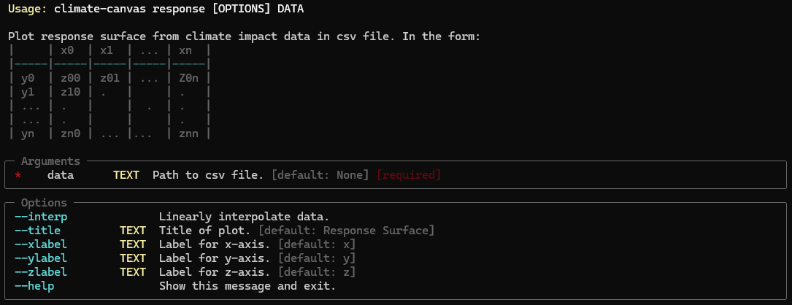
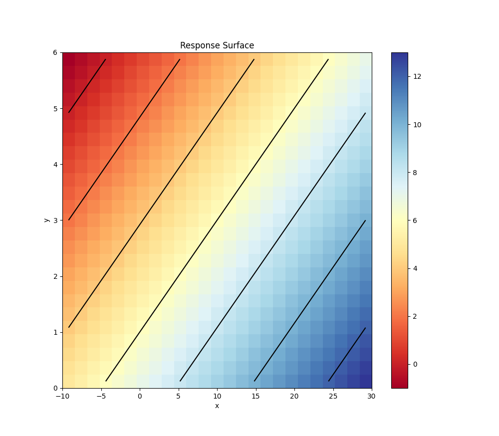

# climate-canvas

Python package and command line interface (CLI) for plotting climate impact study response surfaces and other climate change scenario visualizations.



Example: The figure above is created by running the ``uv run climate-canvas response examples\complex_surface.csv --interp`` climate-canvas CLI command on the *complex_surface.csv* data distributed with the climate-canvas program.

## Installation Instructions

#### System Requirements

climate-canvas requires python 3.12+. It aims to be multi-platform and has been run on Windows 11 and MacOS 14 and 15.

#### Clone or Fork climate-canvas from GitHub
The climate-canvas source code can be found here: https://github.com/JohnRushKucharski/climate-canvas is available under the GNU Version 3 General Public License.

It can be cloned or forked by following the normal cloning or forking instructions, which are available here: https://docs.github.com/en/repositories/creating-and-managing-repositories/cloning-a-repository and here: https://docs.github.com/en/pull-requests/collaborating-with-pull-requests/working-with-forks/fork-a-repo.


#### Installation with uv

climate-canvas is developed with [uv](https://docs.astral.sh/uv/), which can be used to simplify the installation process.

To install uv, follow the instructions here: https://docs.astral.sh/uv/getting-started/installation/.

Once uv is installed, use your favorite shell to go to the location of the local climate-canvas repository, e.g.

``
cd <PATH_TO_LOCAL>\climate-canvas
``

Next run:

``
uv sync --group test
``

This will create a python virtual environment (``.venv``) containing all the required climate-canvas dependencies, without affecting your system's global python environment.

The climate-canvas program should be ready for use as either a python package or command line utility. To test the command line interface (CLI) type the following command into your shell:

``
uv run climate-canvas --help
``

This should return help instructions for the climate-canvas CLI.

## Basic Usage

The climate-canvas program can be extended as a python package or run through a command line interface (CLI).

The current version (0.1.0) only supports 2D climate response surface style plots. These are two-dimensional contour plots that show the impact of two variables plotted on the x and y axes on a response (i.e. z axis) variable whose values are plotted using contour lines and a colorbar. An example is shown below.



#### Command Line Interface

The example above is created **response** command. From a shell run:

``
uv run climate-canvas response --help
``

To view help for the **response** command, i.e.:



As the response help document describes the **response** command requires that a path to a *.csv* file containing plotting data be specified. Two example, data files are provided in the repository's *examples/* directory. The following command, using on of these example files, reproduces the figure above:

``
uv run climate-canvas response examples\scenario_data.csv
``

The *--interp* flag can be used to bi-linearly interpolate between z-axis values. For example, running the following command (using the same data from the figure above) with the *--interp* flag produces the figure below:

``
uv run climate-canvas response examples\scenario_data.csv --interp
``



As the help documentation shows titles for the figure, x, y, and z axes can be added as optional arguments.

The *--threshold* option sets the z-value that becomes the colormap's center (yellow) color, splitting
the color range asymmetrically around it (and adjusting the contour levels to match). If omitted, it
defaults to the midpoint of the data's z-value range. Use *--color-map* to change the matplotlib
colormap (defaults to *RdBu*), and *--color-map-ticks* to set explicit colorbar tick values, e.g.:

``
uv run climate-canvas response examples\scenario_data.csv --threshold 0.2 --color-map RdYlBu
``

#### Python API

`plot_response_surface` (in `climate_canvas.plots_utilities`) can also be called directly as a
library function, e.g. from another package's CLI. It accepts several optional parameters not
exposed by the `response` CLI command:

- `save_path` (`Path | None`, default `None`): when provided, saves the figure to this path.
- `show` (`bool`, default `True`): when `False`, skips the interactive `plt.show()` window
  (useful for batch/headless plotting, e.g. saving one plot per component in a loop). The
  figure is always closed after the call to avoid leaking matplotlib figures.
- `threshold` (`float | None`, default `None`): z-value that becomes the colormap's center color.
  Defaults to the midpoint of the z-value range if `None` or outside that range.
- `color_map` (`str`, default `'RdBu'`): matplotlib colormap name.
- `color_map_ticks` (`list[float] | None`, default `None`): explicit colorbar tick values.

The third element of the `labels` tuple (z label) is rendered as the colorbar's label, in
addition to `labels[0]`/`labels[1]` being used as the x/y axis labels.

```python
from climate_canvas.plots_utilities import plot_response_surface

plot_response_surface(xs, ys, zs, labels=('Precip Delta (%)', 'Temp Delta (C)', 'portion'),
                      save_path='surface.png', show=False, threshold=0.2)
```

